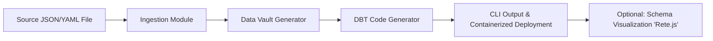

# Epicarc.io - DBT-Vault Accelerator MVP

## Overview

**Epicarc.io** is designed to accelerate the transformation process from source schema ingestion to a fully generated Data Vault model and dbt code, reducing the current 6-8 week cycle to just a few weeks. This tool aims to streamline the current workflow where business requests are manually analyzed, modeled, and then converted into dbt code—a process typically handled by multiple teams. By automating the ingestion of JSON/YAML (for example, exported from Postgres) and generating the corresponding Data Vault structures, Epicarc.io will empower developers within our bank to take on tasks traditionally reserved for BA's and modelers.

## Problem Statement

- **Current Workflow Issues:**  
  - Front-door requests from the business for core banking system data require extensive manual processing.
  - Multiple hand-offs between BA's, modellers, and developers.
  - Reliance on tools like Erwin for physical modeling and Excel for mapping increases complexity and turnaround time.
  
- **Opportunity:**  
  - Automate and accelerate the transformation from source schema to dbt code.
  - Reduce manual intervention by standardizing and automating key processes using a CLI-based tool that can later evolve into a full web interface.
  
## MVP Scope (4 Weeks)

1. **Core Feature: Schema Ingestion and Data Vault Generation**
   - Ingest JSON/YAML files representing a source schema (e.g., from Postgres).
   - Automatically map the input schema into a Data Vault model (hubs, satellites, links) following our standard methodology.
   - Generate corresponding dbt code leveraging existing dbt-vault macros (with customization as needed).

2. **CLI Tool & Containerization**
   - Develop a CLI tool as the primary interface for file uploads and code generation.
   - Ensure the entire solution is containerized (using Docker) to meet our bank’s security requirements and avoid external API calls.

3. **Optional / Future Work**
   - Develop a minimal Erwin replacement for schema visualization using [Rete.js](https://retejs.org/) (if time permits during the sprint).
   - Lay the groundwork for a future web interface that builds on the CLI functionality.

## Tech Stack & Architecture

### Proposed Technologies

- **Backend Language:**  
  - _Debate in progress:_ Options include **Golang**, **Python**, or **Rust**. For the MVP, a rapid-prototyping language such as **Python** is suggested due to its extensive libraries and ease of development.
  
- **CLI Development:**  
  - **Python** with libraries such as [Typer](https://typer.tiangolo.com/) for CLI creation.
  
- **File Parsing & Templating:**  
  - Use Python’s built-in `json` library and [PyYAML](https://pyyaml.org/) for handling JSON/YAML inputs.
  - **Jinja2** for templating and generating dbt code.

- ** Schema Visualization: **
   - Expand visualization capabilities using Rete.js
  
- **Containerization:**  
  - **Docker** for packaging the application.
  
- **Optional Front-end / Visualization:**  
  - **Rete.js** for a minimal Erwin-like schema diagram (planned for later in the sprint).

### Architecture Diagram



## Installation & Setup

### Prerequisites

- **Docker:** Ensure Docker is installed and running.
- **Python 3.8+** (if using Python for the MVP prototype)

### Installation Steps

1. **Clone the Repository:**

   ```bash
   git clone https://github.com/your_org/epicarc.io.git
   cd epicarc.io
   ```

2. **Setup Virtual Environment & Install Dependencies (Python Example):**

   ```bash
   python -m venv venv
   source venv/bin/activate
   pip install -r requirements.txt
   ```

   *Dependencies may include:*  
   - `typer` (for CLI)
   - `pyyaml` (for YAML parsing)
   - `jinja2` (for templating)
   - Any additional libraries for potential dbt integration

3. **Build the Docker Container:**

   ```bash
   docker build -t epicarc-mvp .
   ```

## Usage Instructions

### Running the CLI Tool

1. **File Upload & Ingestion:**  
   - Prepare your source schema file in JSON or YAML format.
   - Run the CLI tool with the file as an argument:

   ```bash
   python epicarc_cli.py --input path/to/schema.yaml
   ```

2. **Expected Workflow:**  
   - The tool ingests the provided schema.
   - Automatically maps the schema to a Data Vault model.
   - Generates dbt code in a pre-defined output directory.
   - (If containerized, the command may be run via Docker as well.)

3. **Configuration Options:**  
   - The tool will include configuration parameters for specifying:
     - Input file location
     - Output directory for dbt code
     - Optional flags to enable schema visualization (if applicable)

## Roadmap & Future Enhancements

1. **MVP Phase (Weeks 1-4):**
   - **Week 1:**  
     - Finalize tech stack decisions.
     - Set up project structure and containerization.
     - Develop the CLI tool framework for file uploads.
   - **Week 2:**  
     - Implement JSON/YAML ingestion.
     - Map input schema to Data Vault structures.
   - **Week 3:**  
     - Generate dbt code using Jinja2 templates.
     - Integrate existing dbt-vault macros with necessary customizations.
   - **Week 4:**  
     - Finalize CLI tool functionality.
     - Prepare documentation and setup instructions.
     - (If time allows) Initiate development of a minimal Erwin replacement for schema visualization.

2. **Post-MVP Enhancements:**
   - Develop a simple web interface for broader accessibility.
   - Enhance direct connectivity with source systems (e.g., live schema extraction from Postgres).
   - Expand visualization capabilities using Rete.js and further improve the UI/UX.
   - Integrate more advanced configuration and logging features for production readiness.

## Contributing

Developers interested in contributing or extending the tool are encouraged to follow our [contributing guidelines](CONTRIBUTING.md). Please ensure to run tests and adhere to the coding standards as outlined in our documentation.

## License

This project is licensed under the MIT License. See the [LICENSE](LICENSE) file for details.
